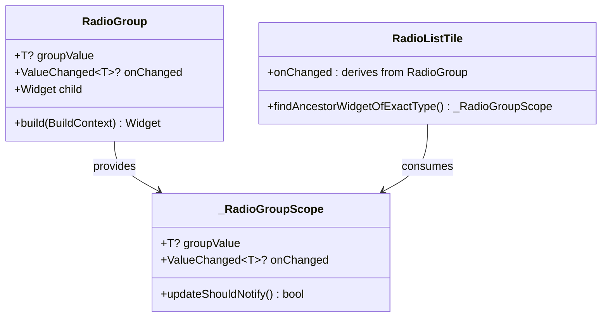

# Flutter Analyzer Issues Resolution Design

## Overview

This design document provides a comprehensive approach to resolve all analyzer issues in the Flutter Core Template project. The primary focus is addressing the missing `RadioGroup` widget implementation and ensuring code quality compliance with the project's strict analyzer rules defined in `analysis_options.yaml`.

## Current Issues Analysis

### Critical Issues
1. **Missing RadioGroup Widget**: The `RadioGroup<T>` widget is referenced in 5 locations but not implemented
2. **Code Quality Violations**: Potential violations of project's strict linting rules

### Affected Files
- `lib/pages/component_showcase/input_component_page.dart`
- `lib/widgets/theme_settings_bottom_sheet.dart` (4 instances)

## Architecture

### RadioGroup Widget Design



### Widget Implementation Strategy

The `RadioGroup` widget will be implemented as an `InheritedWidget` that provides radio button group functionality to its child `RadioListTile` widgets. This approach ensures:

- **Type Safety**: Generic type `T` for different value types
- **State Management**: Centralized group value and change handling
- **Flutter Convention**: Follows established patterns like `Theme` and `MediaQuery`

## Component Specifications

### RadioGroup Widget

**Purpose**: Provides grouped radio button functionality with shared state management

**Key Features**:
- Generic type support for any value type
- Automatic state synchronization between radio buttons
- Inherited widget pattern for efficient updates
- Null-safety compliant implementation

**Properties**:
| Property | Type | Description |
|----------|------|-------------|
| groupValue | T? | Currently selected value in the group |
| onChanged | ValueChanged<T?>? | Callback when selection changes |
| child | Widget | Child widget containing RadioListTile widgets |

### Implementation Structure

```dart
// Core widget structure
class RadioGroup<T> extends StatelessWidget {
  final T? groupValue;
  final ValueChanged<T?>? onChanged;
  final Widget child;
}

// Inherited widget for state sharing
class _RadioGroupScope<T> extends InheritedWidget {
  final T? groupValue;
  final ValueChanged<T?>? onChanged;
}

// Extension for RadioListTile integration
extension RadioListTileGroupExtension<T> on RadioListTile<T> {
  // Automatic integration with RadioGroup scope
}
```

### Code Quality Enhancements

**Compliance Areas**:
1. **Immutable Annotations**: Apply `@immutable` to appropriate classes
2. **Trailing Commas**: Ensure all parameter lists have trailing commas
3. **Const Usage**: Optimize const constructor usage
4. **Code Style**: Follow Dart style guidelines

**Validation Rules**:
- All public classes properly documented (where required)
- Consistent formatting and style
- Proper null-safety implementation
- Performance optimizations through const constructors

## Implementation Details

### RadioGroup Core Implementation

The widget will be implemented with the following structure:

1. **Main Widget**: `RadioGroup<T>` as a StatelessWidget
2. **Inherited Widget**: `_RadioGroupScope<T>` for state propagation
3. **Helper Methods**: Static methods for accessing group state
4. **Type Safety**: Generic constraints and null-safety compliance

### Integration Points

**Theme Settings Integration**:
- ThemeMode selection (existing usage)
- Font family selection (existing usage)
- App theme selection (existing usage)
- Language selection (existing usage)

**Component Showcase Integration**:
- Radio button demonstration (existing usage)

### File Organization

**New File**: `lib/widgets/radio_group.dart`
- Contains complete RadioGroup implementation
- Follows project's code organization patterns
- Includes comprehensive documentation

**Modified Files**:
- No changes required to existing files
- RadioGroup will work automatically with existing RadioListTile usage

## Testing Strategy

### Unit Tests
- RadioGroup widget creation and initialization
- Value change handling and propagation
- Type safety validation across different types
- Null-safety edge cases

### Widget Tests
- RadioGroup integration with RadioListTile
- State synchronization verification
- User interaction simulation
- Accessibility compliance

### Integration Tests
- Theme settings functionality with RadioGroup
- Component showcase page functionality
- Multi-group scenarios

## Validation Criteria

### Functional Requirements
- [ ] RadioGroup widget compiles without errors
- [ ] All existing RadioListTile widgets work correctly
- [ ] Type safety maintained across all usage scenarios
- [ ] State management functions properly

### Code Quality Requirements
- [ ] Zero analyzer errors or warnings
- [ ] Compliance with all linting rules in analysis_options.yaml
- [ ] Proper documentation and comments
- [ ] Performance optimization through const usage

### Compatibility Requirements
- [ ] No breaking changes to existing code
- [ ] Maintains Flutter best practices
- [ ] Cross-platform compatibility
- [ ] Accessibility support

## Performance Considerations

### Optimization Strategies
1. **Const Constructors**: Minimize widget rebuilds
2. **Inherited Widget Pattern**: Efficient state propagation
3. **Minimal Rebuilds**: Only affected radio buttons update
4. **Memory Efficiency**: Lightweight implementation

### Performance Metrics
- Widget build time optimization
- Memory usage efficiency
- State update performance
- Large group handling capability

## Security Considerations

### Type Safety
- Generic type constraints prevent runtime errors
- Null-safety compliance eliminates null reference exceptions
- Compile-time validation of value types

### State Management
- Encapsulated state prevents external manipulation
- Controlled value updates through defined interfaces
- Immutable widget design prevents state corruption### Compatibility Requirements
- [ ] No breaking changes to existing code
- [ ] Maintains Flutter best practices
- [ ] Cross-platform compatibility
- [ ] Accessibility support

## Performance Considerations

### Optimization Strategies
1. **Const Constructors**: Minimize widget rebuilds
2. **Inherited Widget Pattern**: Efficient state propagation
3. **Minimal Rebuilds**: Only affected radio buttons update
4. **Memory Efficiency**: Lightweight implementation

### Performance Metrics
- Widget build time optimization
- Memory usage efficiency
- State update performance
- Large group handling capability

## Security Considerations

### Type Safety
- Generic type constraints prevent runtime errors
- Null-safety compliance eliminates null reference exceptions
- Compile-time validation of value types

### State Management
- Encapsulated state prevents external manipulation
- Controlled value updates through defined interfaces
- Immutable widget design prevents state corruption


