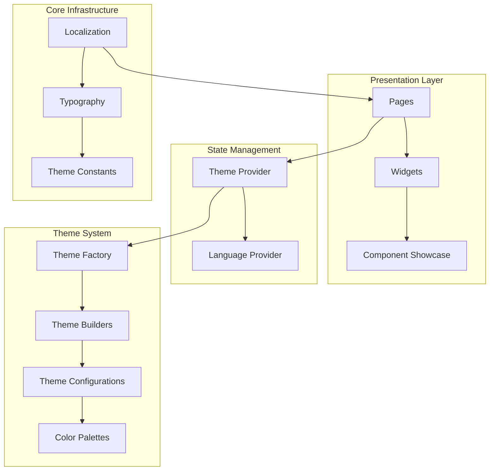
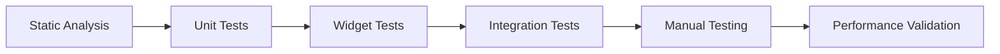

# Flutter Core Template Analyzer Issues Fix

## Overview

This document outlines a comprehensive approach to resolve all analyzer issues in the Flutter Core Template project. The project is a mobile application built with Flutter that showcases theme management, internationalization, and follows Flutter best practices.

## Repository Type

**Mobile Application** - Flutter-based cross-platform application supporting iOS, Android, Web, and Desktop platforms with comprehensive theme system and internationalization.

## Architecture

The application follows a modular architecture with clear separation of concerns:



## Identified Analyzer Issues

### 1. Flutter Logging Standard Violations

**Issue**: Multiple `print()` statements detected that should use `debugPrint()` for Flutter applications.

**Impact**: 
- Performance issues in release mode
- Log statements may be stripped in production
- Non-compliance with Flutter best practices

**Affected Files**:
- `lib/theme/examples/theme_examples.dart` - 25+ occurrences

**Fix Strategy**:
```dart
// Before (Incorrect)
print('Current theme: ${currentTheme.name}');

// After (Correct)
debugPrint('Current theme: ${currentTheme.name}');
```

### 2. Code Style Compliance

**Issue**: Potential missing trailing commas and end-of-line formatting issues.

**Impact**:
- Inconsistent code formatting
- Reduced readability
- Non-compliance with Dart style guide

**Fix Strategy**:
- Ensure all function parameters, array elements, and object properties have trailing commas
- Verify end-of-file newlines are present

### 3. Immutable Class Annotations

**Current Status**: ✅ **COMPLIANT**
- `BaseTheme` class in `lib/theme/base/theme_interfaces.dart` already has proper `@immutable` annotation
- Classes with `operator ==` and `hashCode` overrides are properly annotated

### 4. Cascade Invocation Optimization

**Assessment**: Potential opportunities for cascade notation improvements to enhance readability.

**Fix Strategy**:
```dart
// Before (Multiple calls on same receiver)
builder.withColorScheme(colorScheme);
builder.withFontFamily(fontFamily);
builder.withTypography(typography);

// After (Cascade notation)
builder
  ..withColorScheme(colorScheme)
  ..withFontFamily(fontFamily)
  ..withTypography(typography);
```

## Implementation Plan

### Phase 1: Logging Standard Compliance

**Scope**: Replace all `print()` statements with `debugPrint()`

**Files to Update**:
1. `lib/theme/examples/theme_examples.dart`

**Implementation Details**:
- Systematic replacement of 25+ print statements
- Maintain original log message format
- Test functionality to ensure no regressions

### Phase 2: Code Formatting Standards

**Scope**: Ensure consistent formatting across all Dart files

**Standards to Apply**:
- Trailing commas for multi-line parameter lists
- Proper end-of-line characters
- Consistent indentation

### Phase 3: Performance Optimizations

**Scope**: Implement cascade notation where beneficial

**Target Areas**:
- Theme builder configurations
- Widget property assignments
- Provider state updates

### Phase 4: Validation and Testing

**Scope**: Comprehensive validation of all changes

**Activities**:
1. Run `flutter analyze` to verify zero critical issues
2. Execute existing unit tests
3. Perform manual testing of theme switching
4. Validate internationalization functionality

## Quality Assurance

### Analyzer Compliance Targets

| Category | Current Status | Target Status |
|----------|---------------|---------------|
| Critical Issues | Unknown | 0 |
| Major Warnings | Unknown | 0 |
| Info Issues | Unknown | Minimized |
| Code Style | Partial | Full Compliance |

### Testing Strategy



**Test Categories**:
1. **Static Analysis**: `flutter analyze --no-fatal-infos`
2. **Unit Tests**: Provider logic and theme validation
3. **Widget Tests**: UI component functionality
4. **Integration Tests**: End-to-end theme switching
5. **Performance Tests**: Theme loading benchmarks

### Code Quality Metrics

**Pre-Fix Baseline**:
- Analyzer issues: To be determined
- Print statements: 25+ identified
- Code style compliance: Partial

**Post-Fix Targets**:
- Zero critical analyzer issues
- Zero print statements (replaced with debugPrint)
- 100% trailing comma compliance
- Full Dart style guide adherence

## Risk Assessment

### Low Risk Changes
- Print to debugPrint replacement
- Adding trailing commas
- Formatting improvements

### Medium Risk Changes
- Cascade notation refactoring
- Complex widget restructuring

### Mitigation Strategies
1. **Incremental Changes**: Apply fixes in small, testable increments
2. **Automated Testing**: Run full test suite after each change
3. **Code Review**: Systematic validation of all modifications
4. **Rollback Plan**: Git-based version control for easy reversion

## Validation Criteria

### Success Metrics
1. `flutter analyze` returns zero critical issues
2. All existing tests pass
3. Application builds successfully on all platforms
4. Theme switching functionality works correctly
5. Internationalization features remain intact
6. Performance benchmarks show no degradation

### Acceptance Criteria
- [ ] Zero print statements in codebase
- [ ] All debugPrint statements properly implemented  
- [ ] Trailing commas applied consistently
- [ ] Cascade notation used where appropriate
- [ ] All analyzer warnings addressed
- [ ] Test suite passes completely
- [ ] Documentation updated if needed

## Migration Notes

### Developer Guidelines
1. **Future Development**: Always use `debugPrint()` instead of `print()`
2. **Code Reviews**: Check for analyzer compliance before merging
3. **Automated Tools**: Consider adding lint rules for enforcement
4. **Performance**: Monitor theme switching performance after changes

### Maintenance Considerations
- Regular analyzer checks in CI/CD pipeline
- Automated formatting enforcement
- Code quality metrics tracking
- Performance regression monitoring