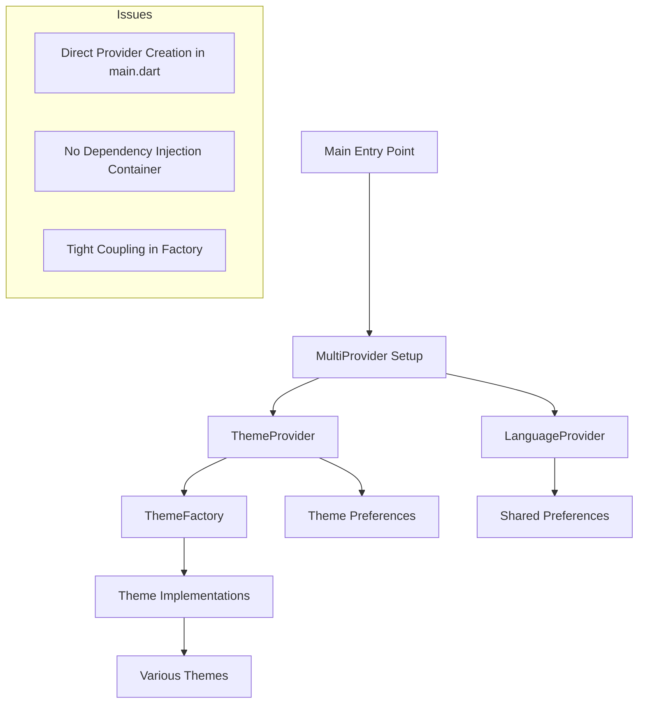
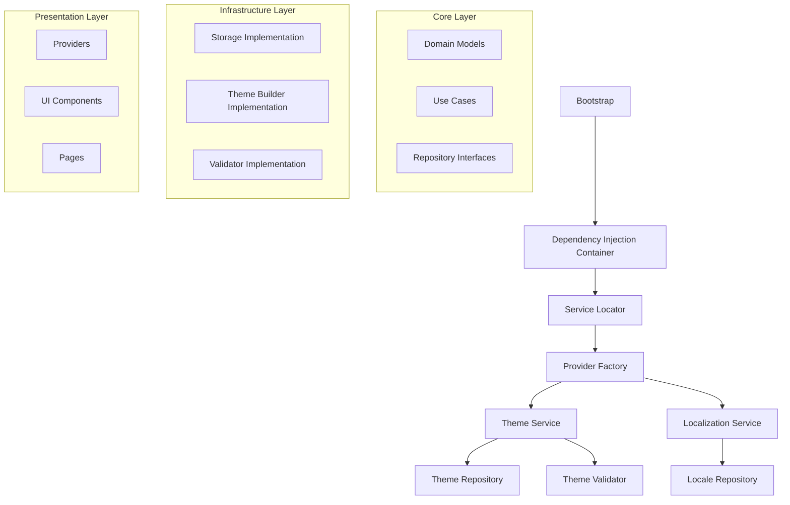
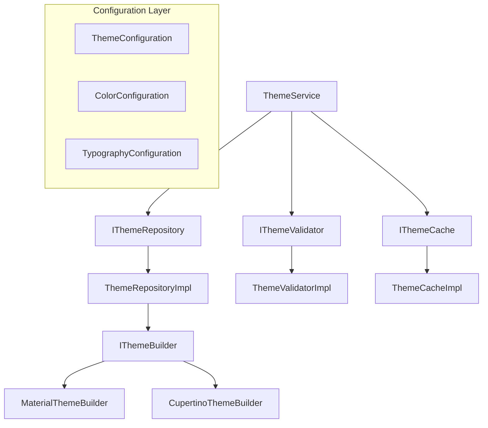
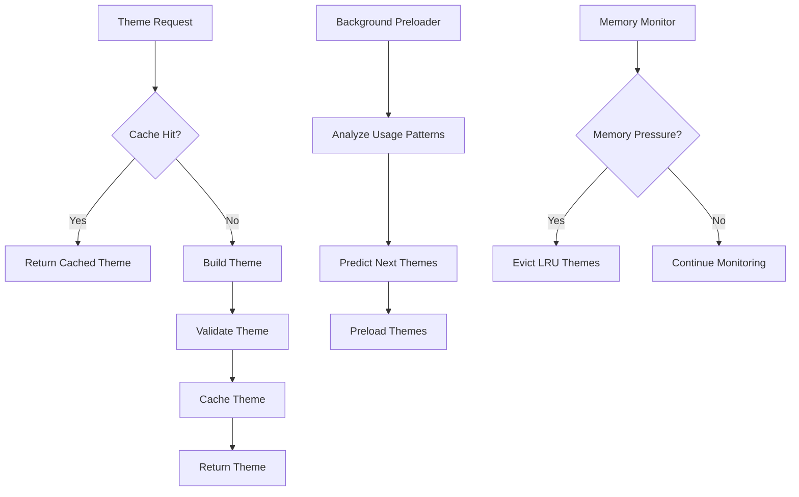

# Flutter Core Template Refactoring Design

## Overview

This design document outlines the comprehensive refactoring plan for transforming the current Flutter Core Template into a professional, production-ready template that follows SOLID principles, clean architecture, and best practices.

### Project Goals
- **Code Quality**: Achieve clean, maintainable, and readable code
- **Architecture**: Implement well-organized, coherent system architecture
- **SOLID Compliance**: Ensure full adherence to SOLID principles
- **Redundancy Elimination**: Remove all unnecessary or duplicate code
- **Template Excellence**: Create an exemplary template for future projects

### Current State Assessment

#### Strengths
- Well-structured theme system with multiple design patterns
- Comprehensive internationalization support
- Performance optimization layer with caching and lazy loading
- Cross-platform compatibility
- Extensive theme variety and customization options

#### Areas for Improvement
- Code organization and dependency management
- Incomplete implementation in utility classes (TODO items)
- Complex provider initialization in main.dart
- Missing abstraction layers in some components
- Inconsistent error handling patterns

## Architecture Refactoring

### Current Architecture Analysis



### Target Architecture



### SOLID Principles Implementation

#### Single Responsibility Principle (SRP)
- **Current Issue**: ThemeProvider handles multiple responsibilities
- **Solution**: Separate concerns into dedicated services

```dart
// Before: ThemeProvider handles everything
class ThemeProvider extends ChangeNotifier {
  // Theme management, preferences, validation, etc.
}

// After: Separated responsibilities
abstract class IThemeService {
  Future<AppTheme> getTheme(String id);
  List<AppTheme> getAvailableThemes();
}

abstract class IThemePreferencesService {
  Future<void> saveTheme(String themeId);
  Future<String?> getTheme();
}

abstract class IThemeValidationService {
  ValidationResult validateTheme(AppTheme theme);
}
```

#### Open/Closed Principle (OCP)
- **Enhancement**: Make theme system extensible without modification
- **Implementation**: Abstract theme builder with extension points

```dart
abstract class ThemeBuilder {
  ThemeData buildTheme(ThemeConfiguration config);
}

class MaterialThemeBuilder extends ThemeBuilder {
  @override
  ThemeData buildTheme(ThemeConfiguration config) {
    // Material-specific implementation
  }
}

class CupertinoThemeBuilder extends ThemeBuilder {
  @override
  ThemeData buildTheme(ThemeConfiguration config) {
    // Cupertino-specific implementation
  }
}
```

#### Liskov Substitution Principle (LSP)
- **Focus**: Ensure all theme implementations are truly substitutable
- **Validation**: Strengthen theme interface contracts

#### Interface Segregation Principle (ISP)
- **Current State**: Good implementation with separate interfaces
- **Enhancement**: Further granular interface segregation

```dart
abstract class IThemeColorProvider {
  ColorScheme getLightColorScheme();
  ColorScheme getDarkColorScheme();
}

abstract class IThemeTypographyProvider {
  TextTheme getTextTheme();
}

abstract class IThemeComponentProvider {
  AppBarTheme getAppBarTheme();
  ButtonThemeData getButtonTheme();
}
```

#### Dependency Inversion Principle (DIP)
- **Implementation**: Introduce dependency injection container
- **Benefits**: Loose coupling and easier testing

## Code Organization Refactoring

### Current Structure Issues
1. **Deep nesting** in theme directory
2. **Mixed concerns** in some files
3. **Incomplete implementations** with TODO comments
4. **Direct instantiation** without dependency injection

### Proposed Structure

```
lib/
├── core/
│   ├── di/                    # Dependency Injection
│   │   ├── service_locator.dart
│   │   └── app_module.dart
│   ├── errors/                # Error handling
│   │   ├── failures.dart
│   │   └── exceptions.dart
│   ├── utils/                 # Shared utilities
│   │   ├── constants.dart
│   │   └── extensions.dart
│   └── validators/            # Validation logic
│       └── base_validator.dart
├── domain/
│   ├── entities/              # Business entities
│   │   ├── theme_entity.dart
│   │   └── locale_entity.dart
│   ├── repositories/          # Repository interfaces
│   │   ├── theme_repository.dart
│   │   └── locale_repository.dart
│   └── use_cases/             # Business logic
│       ├── get_theme_use_case.dart
│       └── change_locale_use_case.dart
├── data/
│   ├── models/                # Data models
│   │   ├── theme_model.dart
│   │   └── locale_model.dart
│   ├── repositories/          # Repository implementations
│   │   ├── theme_repository_impl.dart
│   │   └── locale_repository_impl.dart
│   └── sources/               # Data sources
│       ├── theme_local_source.dart
│       └── preferences_source.dart
├── presentation/
│   ├── providers/             # State management
│   │   ├── theme_provider.dart
│   │   └── locale_provider.dart
│   ├── pages/                 # UI pages
│   │   └── theme_showcase/
│   ├── widgets/               # Reusable widgets
│   │   └── common/
│   └── theme/                 # UI theme implementations
│       ├── builders/
│       ├── configs/
│       └── styles/
└── l10n/                      # Localization
    └── generated/
```

## Theme System Enhancement

### Current Theme Factory Issues
- **Static coupling** to concrete implementations
- **Hard to test** due to static methods
- **Violates DIP** by depending on concrete classes

### Enhanced Theme Architecture



### Theme Builder Pattern Enhancement

```dart
// Enhanced builder with fluent interface
class FluentThemeBuilder {
  late ThemeConfiguration _config;
  
  FluentThemeBuilder() {
    _config = ThemeConfiguration.empty();
  }
  
  FluentThemeBuilder colors(ColorConfiguration colors) {
    _config = _config.copyWith(colors: colors);
    return this;
  }
  
  FluentThemeBuilder typography(TypographyConfiguration typography) {
    _config = _config.copyWith(typography: typography);
    return this;
  }
  
  FluentThemeBuilder components(ComponentConfiguration components) {
    _config = _config.copyWith(components: components);
    return this;
  }
  
  AppTheme build() {
    final validator = ServiceLocator.get<IThemeValidator>();
    final result = validator.validate(_config);
    
    if (!result.isValid) {
      throw ThemeValidationException(result.errors);
    }
    
    return AppTheme.fromConfiguration(_config);
  }
}
```

## Error Handling & Validation

### Current State
- Basic try-catch blocks
- Inconsistent error handling patterns
- Limited validation feedback

### Enhanced Error Handling

```dart
// Core error types
abstract class Failure {
  final String message;
  final String? code;
  
  const Failure(this.message, {this.code});
}

class ThemeFailure extends Failure {
  const ThemeFailure(super.message, {super.code});
}

class LocaleFailure extends Failure {
  const LocaleFailure(super.message, {super.code});
}

// Result pattern for error handling
sealed class Result<T> {
  const Result();
}

class Success<T> extends Result<T> {
  final T data;
  const Success(this.data);
}

class Error<T> extends Result<T> {
  final Failure failure;
  const Error(this.failure);
}
```

### Validation Framework

```dart
abstract class IValidator<T> {
  ValidationResult validate(T input);
}

class ValidationResult {
  final bool isValid;
  final List<ValidationError> errors;
  final List<ValidationWarning> warnings;
  
  const ValidationResult({
    required this.isValid,
    this.errors = const [],
    this.warnings = const [],
  });
}

class ThemeValidator implements IValidator<ThemeConfiguration> {
  @override
  ValidationResult validate(ThemeConfiguration config) {
    final errors = <ValidationError>[];
    final warnings = <ValidationWarning>[];
    
    // Color validation
    if (!_isValidColorScheme(config.colors)) {
      errors.add(ValidationError.invalidColorScheme());
    }
    
    // Accessibility validation
    if (!_hasAdequateContrast(config.colors)) {
      warnings.add(ValidationWarning.poorContrast());
    }
    
    return ValidationResult(
      isValid: errors.isEmpty,
      errors: errors,
      warnings: warnings,
    );
  }
}
```

## Performance Optimization

### Current Performance Features
- Theme caching system
- Lazy loading implementation
- Predictive preloading

### Enhanced Performance Strategy



### Memory Management

```dart
class ThemeCacheManager {
  final int _maxCacheSize;
  final Map<String, CachedTheme> _cache = {};
  final Queue<String> _accessOrder = Queue();
  
  ThemeCacheManager({int maxCacheSize = 10}) : _maxCacheSize = maxCacheSize;
  
  AppTheme? getTheme(String id) {
    final cached = _cache[id];
    if (cached != null) {
      _updateAccessOrder(id);
      return cached.theme;
    }
    return null;
  }
  
  void cacheTheme(String id, AppTheme theme) {
    if (_cache.length >= _maxCacheSize) {
      _evictLeastRecentlyUsed();
    }
    
    _cache[id] = CachedTheme(
      theme: theme,
      timestamp: DateTime.now(),
    );
    _updateAccessOrder(id);
  }
  
  void _evictLeastRecentlyUsed() {
    if (_accessOrder.isNotEmpty) {
      final lruId = _accessOrder.removeFirst();
      _cache.remove(lruId);
    }
  }
}
```

## Testing Strategy

### Current Testing
- Basic unit tests for providers
- Limited coverage of theme logic

### Enhanced Testing Framework

```dart
// Test utilities
class MockThemeRepository extends Mock implements IThemeRepository {}
class MockThemeValidator extends Mock implements IThemeValidator {}

// Test data builders
class ThemeTestDataBuilder {
  late ThemeConfiguration _config;
  
  ThemeTestDataBuilder() {
    _config = ThemeConfiguration.defaultConfig();
  }
  
  ThemeTestDataBuilder withColors(ColorConfiguration colors) {
    _config = _config.copyWith(colors: colors);
    return this;
  }
  
  ThemeConfiguration build() => _config;
}

// Integration test helpers
class ThemeTestHelper {
  static Future<void> pumpThemeWidget(
    WidgetTester tester,
    Widget child,
    AppTheme theme,
  ) async {
    await tester.pumpWidget(
      MaterialApp(
        theme: theme.lightThemeData,
        darkTheme: theme.darkThemeData,
        home: child,
      ),
    );
  }
}
```

### Test Coverage Requirements
- **Unit Tests**: 95% coverage for business logic
- **Widget Tests**: All custom widgets and pages
- **Integration Tests**: End-to-end theme switching flows
- **Golden Tests**: Visual regression testing for themes

## Implementation Phases

### Phase 1: Core Infrastructure (Week 1-2)
1. **Dependency Injection Setup**
   - Implement service locator
   - Create app module configuration
   - Migrate providers to use DI

2. **Error Handling Framework**
   - Define failure types
   - Implement Result pattern
   - Add validation framework

3. **Repository Pattern Implementation**
   - Create repository interfaces
   - Implement data layer
   - Add proper abstractions

### Phase 2: Theme System Refactoring (Week 3-4)
1. **Theme Service Layer**
   - Refactor ThemeProvider to use services
   - Implement theme repository
   - Add theme validation service

2. **Builder Pattern Enhancement**
   - Create fluent theme builder
   - Implement configuration-based building
   - Add theme factory improvements

3. **Performance Optimization**
   - Enhance caching mechanisms
   - Improve memory management
   - Add predictive loading

### Phase 3: Code Quality & Testing (Week 5-6)
1. **Complete TODO Implementations**
   - Finish theme refactoring utilities
   - Complete theme standardization
   - Implement missing validations

2. **Comprehensive Testing**
   - Write unit tests for all services
   - Add widget tests for components
   - Implement integration tests

3. **Code Quality Improvements**
   - Apply linting rules consistently
   - Add documentation
   - Optimize performance bottlenecks

### Phase 4: Documentation & Finalization (Week 7)
1. **Documentation Update**
   - Update README files
   - Create migration guides
   - Add API documentation

2. **Template Optimization**
   - Create template configuration
   - Add project scaffolding scripts
   - Optimize for reusability

## Quality Assurance

### Code Quality Metrics
- **Cyclomatic Complexity**: Max 10 per method
- **Class Size**: Max 200 lines per class
- **Method Size**: Max 30 lines per method
- **Test Coverage**: Minimum 90%

### Architecture Compliance
- All dependencies must follow DIP
- No circular dependencies
- Clear separation of concerns
- Consistent naming conventions

### Performance Benchmarks
- Theme switching: < 100ms
- App startup: < 2 seconds
- Memory usage: < 50MB baseline
- No memory leaks in theme switching

## Migration Guide

### For Existing Projects
1. **Backup Current Implementation**
2. **Migrate Providers**: Update to use dependency injection
3. **Update Theme Usage**: Switch to new theme service APIs
4. **Test Integration**: Ensure all functionality works
5. **Performance Validation**: Verify performance improvements

### Breaking Changes
- ThemeFactory static methods → Service-based approach
- Direct ThemeProvider usage → Service layer abstraction
- Theme construction patterns → Configuration-based building

This refactoring design transforms the Flutter Core Template into a professional, maintainable, and extensible foundation for future Flutter projects while adhering to industry best practices and SOLID principles.